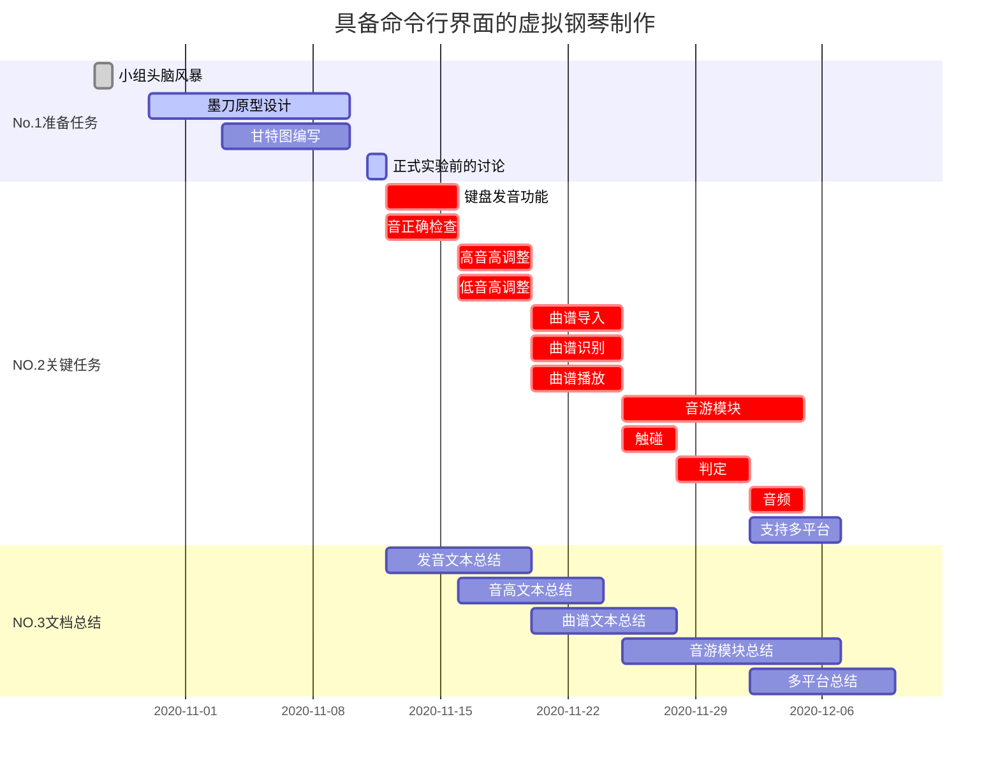

```mermaid
gantt         
       dateFormat  YYYY-MM-DD   
       title 具备命令行界面的虚拟钢琴制作

       section No.1准备任务
       小组头脑风暴           :done,    des1, 2020-10-27,24h
       墨刀原型设计               :active,  des2, 2020-10-30,2020-11-10
       甘特图编写               :active         des3, 2020-11-03,2020-11-10
       正式实验前的讨论           :active ,      des4,2020-11-11,24h

       section NO.2关键任务
       键盘发音功能          :crit, 2020-11-12,4d
       音正确检查          :crit, 2020-11-12,4d
       
       高音高调整         :crit,  2020-11-16, 4d
       低音高调整         :crit,  2020-11-16, 4d
      
       曲谱导入            :crit,2020-11-20,5d
       曲谱识别             :crit,2020-11-20,5d
       曲谱播放             :crit,2020-11-20,5d
       
       音游模块        :crit, 2020-11-25,10d
       触碰        :crit, 2020-11-25,3d
       判定        :crit, 2020-11-28,4d
       音频        :crit, 2020-12-02,3d
       
       支持多平台           :2020-12-02,5d
       

       section NO.3文档总结
       发音文本总结   :2020-11-12,8d
       音高文本总结   :2020-11-16,8d
       曲谱文本总结   :2020-11-20,8d
       音游模块总结   :2020-11-25,12d
       多平台总结     :2020-12-02,8d
      
```